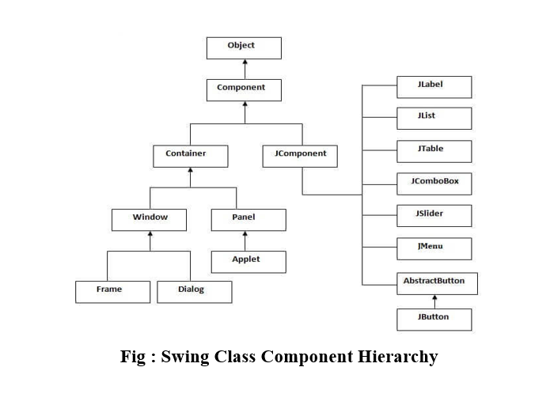

# Swing Components.

 

-  Java Swing is a part of Java Foundation Classes (JFC) that is used to create window-based    applications. It is built on the top of AWT (Abstract Windowing Toolkit) API and entirely written in java.
- Unlike AWT, Java Swing provides platform-independent and lightweight components.
- Swing is the most flexible and robust approach.

## JComponents:

### JFrame:
    - syntax:
     import javax.swing.*;
     import java.awt.*;

     public class Demo extends JFrame{
        Public Demo(){

        }
        PSVM(){
            Demo d= new Demo();
            d.setSize();
            d.setVisible();
            d.setTitle();
            d.setDefaultCloseOperation(EXIT_ON_CLOSE)

        }
     }
 ## ImageIcon:
  
  - ImageIcon is used to add Image on Any Images Supporting Component.
  - There are several ways to add Images on Components like Read From File, Download from URL, or accessing it from Local System.
  
 * Constructors:
     - ImageIcon(String filename);
     - ImageIcon(URL url);  // download the image from the URL.
  
 * Methods :
     - int getIconHeight(); : return height of image in px.
     - int getIconWidth();
     - void paintIcon(component obj, Graphic g, int x, int y)
  
  ## JLabel:
   - the instance of JLable class create labels used to provide instruction and information.
   - This Component provide the following Constructors.
     1. JLabel( ImageIcon obj);
     2. JLabel( String Str);
     3. JLabel( String str, IamgeIcon obj, int allignment).
   
    * Methods:
       1. void setIcon(ImageIcon);
       2. void setText(String str);
       3. ImageIcon getIcon();
       4. String getText();
   
   ## JTextField:
    - JTextField is the most simplest and most used in component in Swing.
    - The JTextField allow to edit single line textfield.
    - used to take input from user.
   
   * Contructors:
     1. JtextField();
     2. JTextFiled( String text);
     3. JTextField( int max-char);
     4. JtextField( String Text, int max-char);
   
   
   ## JTextArea:
   - It display textField with mutiline.
   - It is used when we want to take input from user in more than one line or in paragraph.
   - It doent manage scrolling.
   
   *  Contructors:
       1. JTextArea()
       2. JTextArea( String text);
       3. JTextArea( int rows, int columns);
       4. JtextArea( String str, int rows, int columns);

  ## JButton
  - the JButton is very much different from AWT Buttons
  - JButton Are used to create button so that we can persorm action using that buttons.
  
* Constructors:
    1. JButton(String Label)
    2. Jbutton( Images icon);
    3. Jbutton( String str, IamgeIcon Obj).
  
* Methods:
    1. void setLabel(String str);
    2. string getLabel();
    3. void setIcon();
    4. imageIcon getIcon();

## JCheckBox:
- JRadioButton isdireved class of JToggleButton
- Jcheckbox are used to select mutilpe option from the given options.
- we can inert images on checkbox also in swing.
  
* Contructors:
   1. JCheckBox(ImageIcon obj);
   2. JcheckBox(ImageIcon obj, Boolean State)
   3. JCheckBox(String str)
   4. JCheckBox( String str, ImageIcon obj);
   5. JCheckBox( String str, ImageIcon obj, Boolean state);
   
* Methods:
  1. void setText(String Text);
  2. String getText()
  3. void setIcon( IamgeIcon Obj);
  4. ImageIcon getIcon();
  5. void selected( bool state);
  6. Boolean isSelected();

## JRadioButton

- JRadioButton isdireved class of JToggleButton

* Constructors:
     1. JRadioButton( IamgeIcon Obj);
     2. JRadioButton( ImageIcon obj, Boolean state);
     3. JRadioButton( String Text);
     4. JRadioButton( String Text, IamgeIcon Obj);
     5. JRadioButton( String Text, Bool state);
     6. JRadioButton ( String Text, ImageIcon onj, bool State).

ButtonGroup is used to Group them so that Only one radio button get seleted.

## JComboBox:

- swing provides JComboBox class that create Combo box.
- combo box is a collection of input text field and dropdown list.
- By defalut it shows dropdown list that allow user to select one of them. but user can also type his se;ection into textfield.

* Constructors:
   1. JcomboBox()  : create an empty combobox
   2. JcomboBox( Vector obj);  : fill vector items into combobox.

- items can be added manually by addItem() method.
- defined as void addItem( Object obj);
    